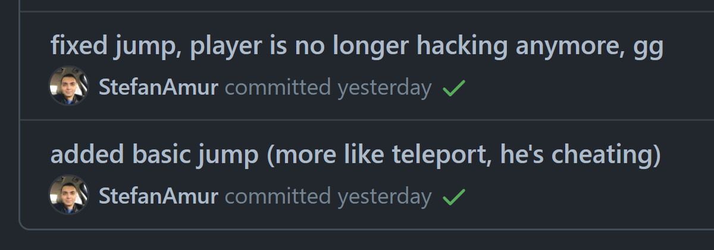

# Parallax

This is an exercise from [BeCode](https://becode.org/) in which we were provided with some background images and a character with different stages (idle, running, jumping, etc).  
The goal was to take these assets and make a mini Javascript game.  
The project is deployed on GitHub pages and can be accessed following this [link](https://stefanamur.github.io/challenge-parallax/).

## The mission (as per the instructions received)

In this repository you will find some images. If you position them over each other in the right order you will get a pretty background. Our goal now will be to animate each piece based on how far it is in the background. The first layer (the ground) will move fastest, the last (the sky) will be static.

## Must-have features

- ✔1️⃣a page with a moving background that looks natural
- ✔2️⃣something of your personal choosing to enhance the page, go take a look at the suggestions or come up with something yourself!

## Exercise type and duration

We had 3️⃣ days to complete it (17/11-19-11) and it was a solo exercise.

## How did it go?

### Day 1️⃣

Well, the assets included were really good and having them meant that I could start working on the functionality right away.  
The minimum (and only) requirement was to have a parallax effect, basically different background images that move with different speeds creating the illusion of distance.  
While [Tim](https://github.com/Timmeahj), our coach, did a live coding session the evening before the exercise and coded the same thing, I took no notes and forgot almost everything by the next day🤦‍♂️. The only thing I remembered was that he used an array to store the keyboard input from the player so I started with that.

> note to self: `if(coachLiveCodesStuff) takeNotes;`

At the end of the first day I had the background parallax effect and the player that was moving (well, actually the background moved).

### Day 2️⃣

Day 2️⃣ started by adding a basic jump functionality. And when I say jump, I mean teleport as also noticed in the commits messages.

By the end of day 2️⃣ I also added a basic "obstacle" which was just a small green div and started working on the collision detection.

### Day 3

In day 3️⃣ I worked more on the obstacle detection logic and made some progress but by the end of the day it was not 100% working.  
It would only detect a collision while moving left towards the obstacle. If moving right towards the obstacle, collision wasn't detected.  
I did spend a lot of time trying to use `Element.getBoundingClientRect()` to detect a collision but to no avail so I just compared the obstacle's top and right position with the player's position.  
For the left side of the obstacle there's more work to be done. There's probably a better way that I don't (yet) know about.

### Captain's log end of the exercise

> It was really great and fun to do it, I really enjoyed the freedom that came knowing that the only requirement was the parallax effect which was done by the end of day 1️⃣.  
> It's always nice to be able to freely experiment and not have to worry about deadlines like in some other previous projects.  
> We now have one week of vacation and for some reason I kinda wish we didn't. Strange....
